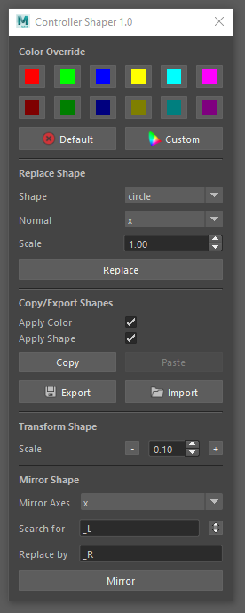

# Controller Shaper
A toolbox for shaping controllers.

## Installation
Put the repository somewhere where maya can see it such as 'C:/Users/user/Documents/maya/scripts'. Then run this from maya to open the toolbox:
```python
from ctrlShaper.ui import CtrlShaper
ui = CtrlShaper()
ui.show()
```
## How to Use

### Color Override
Select some controllers (or curves) to color them with the wanted color.
### Replace Shape
Select some controllers (or any transform) to replace its curves by the chosen shape at the chosen scale facing the chosen axes (normal).
### Copy/Export Shapes
Select a controller (or any transform) to copy its curves. Then paste it on a selection of controllers (or any transform). It's possible to paste only the color or the shape.
### Transform Shape
Select some controllers (or curves) to scale them as wanted.
### Mirror Shape
Select some controllers to mirror them based on their names (that can be parameterized using search for and replace by fields). The mirror axes is worldSpace based.